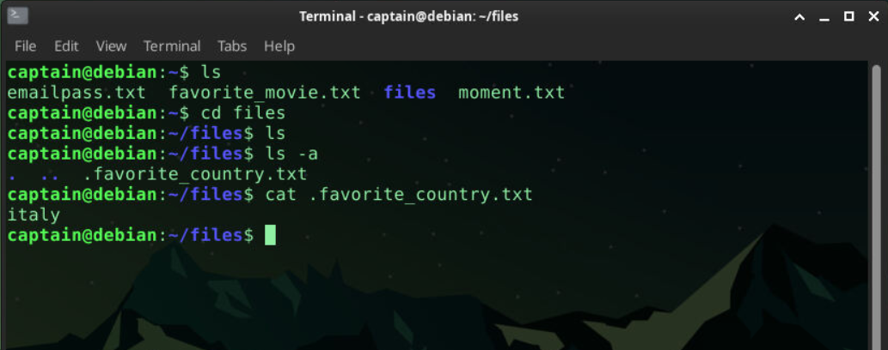
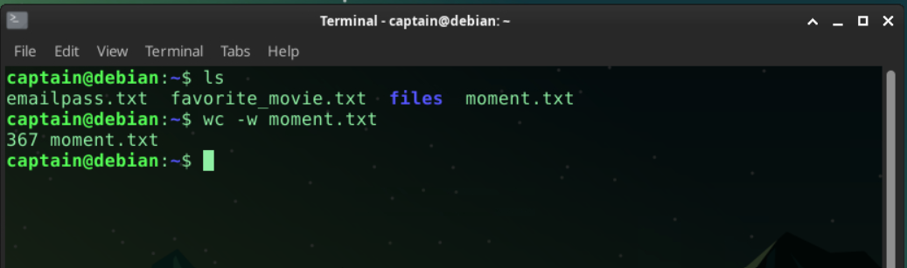
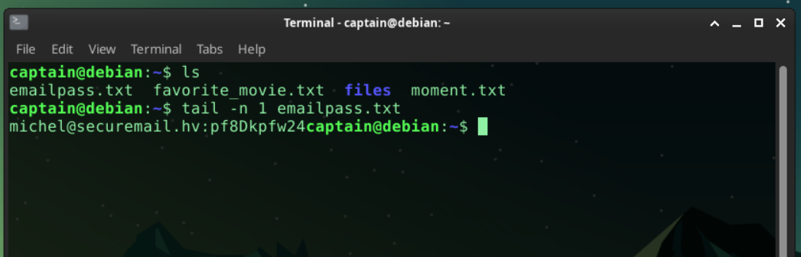
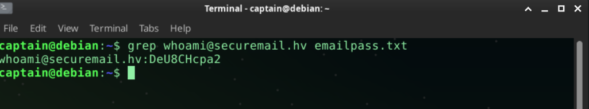
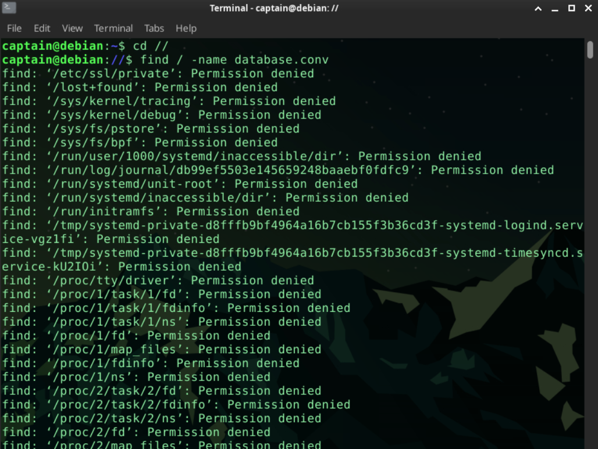
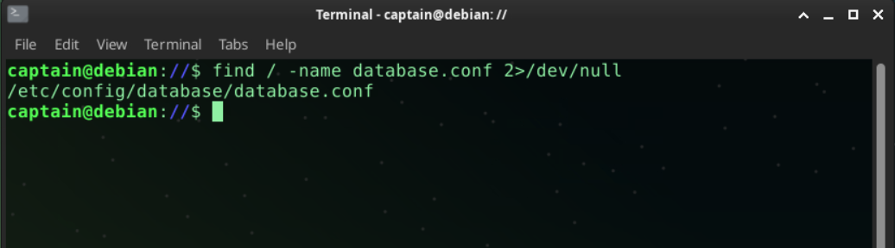
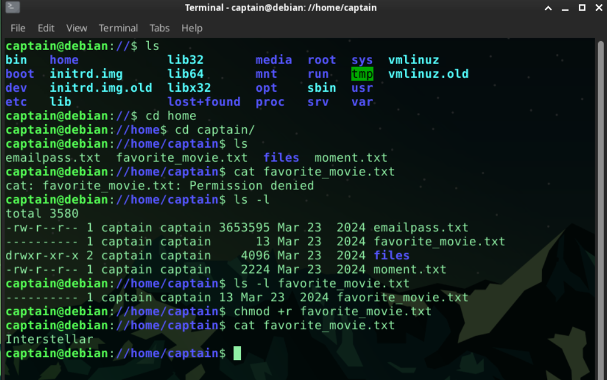

# Hackviser - Linux Fundamentals Capstone Write-up

* **Platform:** Hackviser
* **Kategori:** Linux / Temel Komutlar
* **Yöntem:** SSH & Terminal
* **Zorluk:** Kolay
* **Tarih:** 03.12.2025

## 1. Giriş
Bu çalışma, Hackviser platformundaki "Linux Temelleri" modülünün final sınavı çözümüdür. Senaryo gereği bize verilen `captain` kullanıcısı ile hedef makineye SSH bağlantısı kurarak görevleri tamamladım.

**Verilen Bağlantı Bilgileri:**
* **Kullanıcı Adı:** captain
* **Parola:** shadow
* **Port:** 22

**Bağlantı Adımı:**
VPN bağlantımı sağladıktan sonra hedef IP adresine aşağıdaki komutla bağlandım:

```bash
ssh captain@<hedef_ip>
# Parola sorulduğunda 'shadow' girildi ve sisteme erişim sağlandı.
```
### Soru 1:
**Görev:** `/home/captain/files` dizininde bulunan dosyanın içerisinde yer alan bilgi nedir?

**Çözüm:**
Öncelikle belirtilen dizine geçiş yaptımls kullandığımda dizin boş görünüyordu gizli dosyaları görebilmek için
ls -a komutunu kullnarak

 `.favorite_country.txt` dosyasını buldum ve cat komutu ile içeriğine eriştim.

```bash
cd /home/captain/files
ls      # Çıktı yok (Dizin boş görünüyor)
ls -a   # Gizli dosyaları listeler: .favorite_country.txt bulundu
cat .favorite_country.txt
```


### Soru 2:
**Görev:** `/home/captain/moment.txt` dosyasının içeriğinin kelime sayısı kaçtır?

**Çözüm:**
wc komutu ile çözüme ulaştım

wc komutu normalde satır, kelime ve karakter sayısını birlikte verir. Ancak görevde sadece **kelime sayısı** istendiği için `-w`  parametresini ekleyerek çalıştırdım

```bash
cd /home/captain
wc -w moment.txt
```


### Soru 3:
**Görev:** `/home/captain/emailpass.txt` dosyasının son satırında bulunan e-posta:parola bilgisi nedir?

**Çözüm:**
Dosyanın tamamını ekrana basmak `cat` yerine, sadece en sondaki veriyi istediğimiz için `tail` komutunu kullandım Bu komut varsayılan olarak son 10 satırı gösteri -n "istenen değer" şeklinde ekleme yaparak satır sayısını değiştirebiliyoruz bu soru için 1 değerini kullandık.

```bash
cd /home/captain
tail -n 1 emailpass.txt
```


### Soru 4:
**Görev:** `/home/captain/emailpass.txt` dosyasında bulunan `whoami@securemail.hv` e-posta adresine ait parola nedir?

**Çözüm:**
Dosya içinde spesifik bir ifadeyi aramak için `grep` komutu kullanılır Dosyanın tamamını okuyup gözle aramak yerine `grep` ile filtreleme yaparak cevaba ulaştım

```bash
cd /home/captain
grep "whoami@securemail.hv" emailpass.txt
```


### Soru 5: Komut Konumu Bulma
**Görev:** `hello` komutunun çalışma yolu (path) nedir?

**Çözüm:**
 Bir komutun hangi dizinde kurulu olduğunu öğrenmek için `which` komutunu kullandım.

```bash
which hello
# Çıktı: /usr/bin/hello
```
### Soru 6: 
**Görev:** `database.conf` dosyasının bulunduğu konum nedir?

**Çözüm:**
Sistem genelinde belirli bir isme sahip dosyayı bulmak için `find` komutunu kullandım. Aramayı kök dizinden (`/`) başlatarak tüm sistemi taradım.

*(Not: Erişim iznim olmayan dizinlerden gelen hata mesajlarını gizlemek için komutun sonuna `2>/dev/null` ekledim.)*

```bash
cd //
find / -name database.conf 2>/dev/null
```
 |

### Soru 7: 
**Görev:** `/home/captain/favorite_movie.txt` dosyasının içerisinde yer alan bilgi nedir?

**Çözüm:**
Dosyayı doğrudan `cat` komutuyla okumaya çalıştığımda "Permission denied" (Erişim reddedildi) hatası aldım.

Bunun üzerine `ls -l` komutuyla dosya izinlerini kontrol ettim ve dosyanın `captain` kullanıcısına ait olduğunu gördüm ancak okuma iznim olmadığı için okuyamıyordum bu yüzden `chmod` komutunu kullanarak kendime okuma izni verdim bolelikle erişim sağlayabildim.

```bash
cd /home/captain
ls -l favorite_movie.txt
chmod +r favorite_movie.txt
cat favorite_movie.txt

```


---

### Soru 8: Kullanıcı UID Bilgisi
**Görev:** `specter` kullanıcısının UID değeri nedir?

**Çözüm:**
Linux sistemlerde bir kullanıcının ID değerlerini (UID, GID) görüntülemek için `id` komutu kullanılır.
* **UID (User ID):** Kullanıcı Kimliği. İşletim sistemi kullanıcıları isimleriyle değil, bu benzersiz numara ile tanır.
* **GID (Group ID):** Grup Kimliği. Kullanıcının üye olduğu birincil grubu temsil eder.
```bash
id specter
# Çıktı: uid=1001(specter) gid=1001(specter) groups=1001(specter)
```