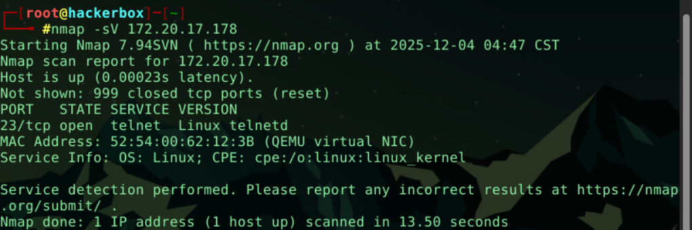
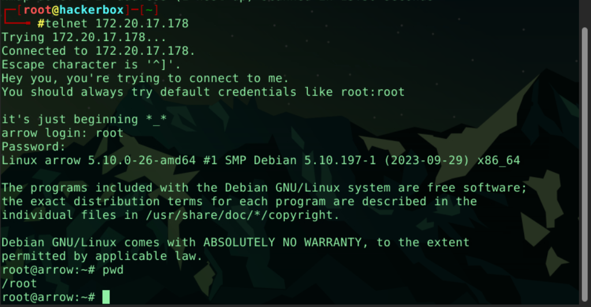

# Telnet

Bu çalışma, hedef sistem üzerindeki açık portların tespiti, çalışan servislerin analizi ve varsayılan kimlik bilgileri kullanılarak sisteme erişim sağlanmasını kapsamaktadır.

## 🎯 Hedef ve Amaçlar
* Açık portların ve servis versiyonlarının tespiti (`nmap`).
* Telnet servisi üzerinden bilgi toplama (Banner Grabbing).
* Varsayılan şifreleri deneyerek sisteme giriş yapma.
* Sistem içi temel keşif komutları (`hostname`, `pwd`).

---

## 🔍 Keşif ve Çözüm Adımları

### 1. Port Taraması (Nmap)
Hedef IP adresine yönelik yapılan versiyon taraması (`-sV`) sonucunda 23. portun açık olduğu tespit edilmiştir.

* **Komut:** `nmap -sV <Hedef_IP>`
* **Sonuç:** Port 23 üzerinde **Linux telnetd** servisi çalışmaktadır.

### 2. Telnet Bağlantısı ve Erişim
Nmap çıktısındaki Telnet servisine bağlantı kurulduğunda, sistem banner'ı üzerinde *"You should always try default credentials like root:root"* (Her zaman root:root gibi varsayılan şifreleri denemelisin) şeklinde bir ipucu/uyarı ile karşılaşılmıştır.

Bu ipucu doğrultusunda **root:root** bilgileri denenmiş ve sisteme başarılı bir şekilde giriş yapılmıştır.

---

## ❓ Sorular ve Cevaplar

**1. Hangi port(lar) açık?**
> **23/tcp** (Telnet)

**2. Çalışan servisin adı nedir?**
> **telnetd**

**3. Hostname nedir?**
> **arrow**

**4. Telnet'e bağlanmak için kullandığınız username:password nedir?**
> Banner üzerindeki ipucu ve yaygın varsayılan şifre denemesi sonucu:
> **Kullanıcı:** `root`
> **Şifre:** `root`

**5. Telnet'e bağlandığınızda çalışma dizini konumunuz nedir?**
> `pwd` komutu çıktısına göre: **/root**

---

## 📸 Kanıtlar (Screenshots)

**Aşama 1: Nmap Taraması ve Servis Tespiti**

**Aşama 2: Telnet Bağlantısı, Login İşlemi ve Hostname Kontrolü**

---

## Nmap Çıktısı

Bu çalışmada Nmap çıktısında yer alan bazı kritik detaylar, hedef sistemin yapısı hakkında önemli ipuçları vermiştir:

* **Düşük Gecikme Süresi (Latency):**
    * `Host is up (0.00023s latency)`: Gecikme süresinin mikrosaniye seviyesinde olması, hedefin fiziksel olarak çok uzakta olmadığını, aynı yerel ağda veya ana makine üzerinde çalışan sanal bir sistem olduğunu gösterir.

* **Firewall Tespiti (RST Paketi):**
    * `Not shown: 999 closed tcp ports (reset)`: Kapalı portların "Reset" (RST) bayrağı ile dönmesi, hedef makine ile aramızda paketleri engelleyen aktif bir Güvenlik Duvarı  olmadığını gösterir. Eğer Firewall olsaydı paketler genellikle düşürülürdü (Drop/Filtered).

* **Sanallaştırma Tespiti:**
    * `MAC Address: ... (QEMU virtual NIC)`: MAC adresi üreticisinin "QEMU" olarak görünmesi, hedef sistemin fiziksel bir sunucu değil,Virtual Machine olduğunu doğrular.

* **CPE (Common Platform Enumeration):**
    * `cpe:/o:linux:linux_kernel`: Tespit edilen servislerin standart isimlendirme formatıdır. Bu bilgi, ileride otomatik zafiyet tarama araçlarında (Nessus, OpenVAS) veya exploit veritabanlarında (Searchsploit) arama yaparken kullanılır.