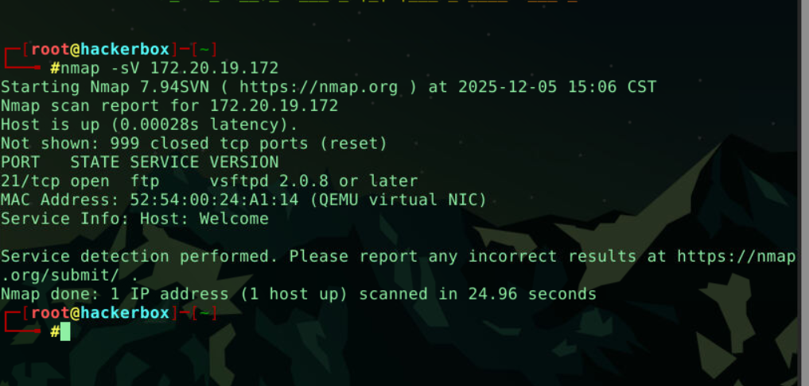
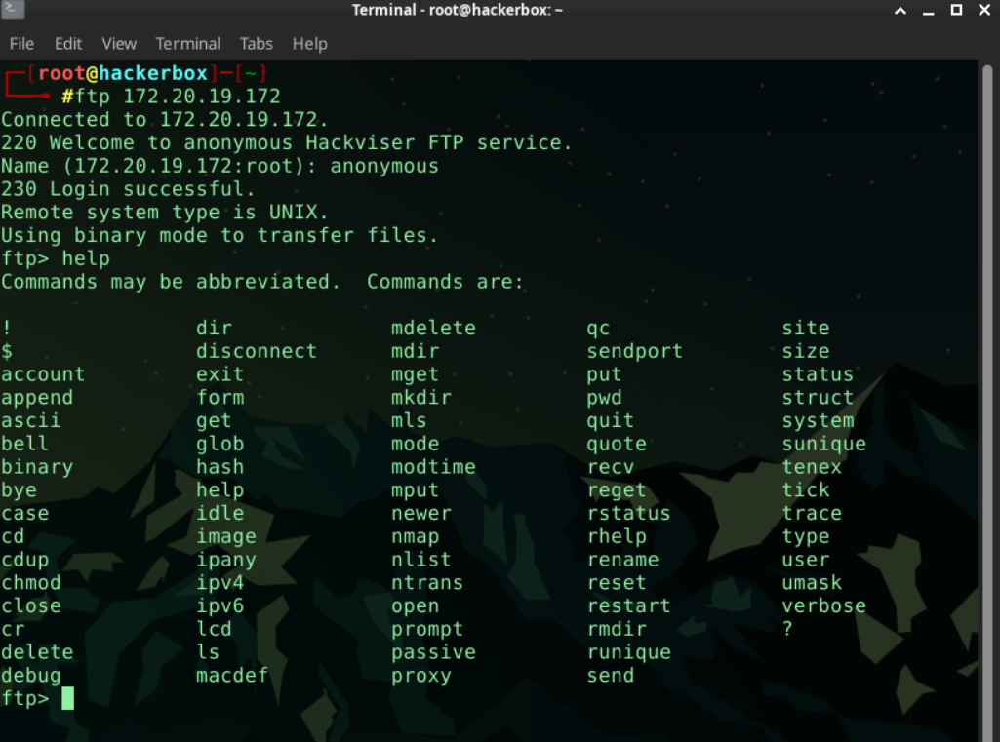
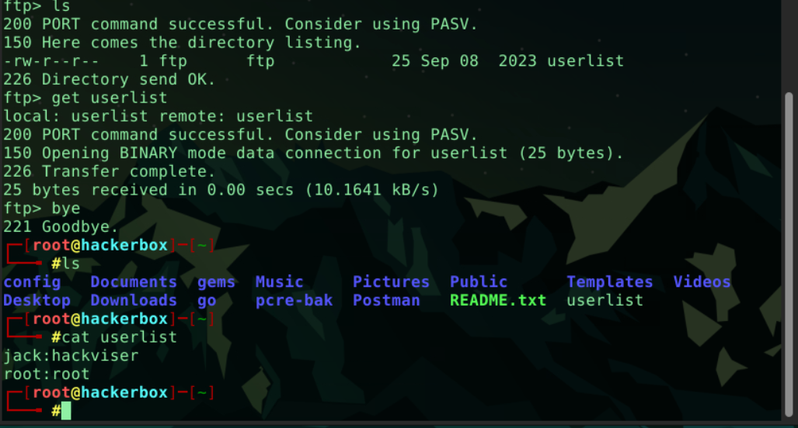

# FTP Servis Keşfi ve Veri İfşası (Lab Çözümü)

Bu çalışma, hedef sistem üzerindeki açık portların tespiti, FTP servisinin analizi ve yapılandırma eksikliği (Anonymous Login) kullanılarak sunucu içerisindeki dosyalara erişim sağlanmasını kapsamaktadır.

## 🎯 Hedef ve Amaçlar
* Açık portların tespiti (`nmap`).
* FTP servisine anonim bağlantı sağlama.
* FTP sunucusunda komut keşfi ve dosya listeleme.
* Uzak sunucudan dosya indirme (`get`) ve veri analizi.

---
## ❓ Sorular ve Cevaplar

**1. Hangi port(lar) açık?**
> **21/tcp** (FTP)

**2. FTP’nin açılımı nedir?**
> **File Transfer Protocol**

**3. FTP'ye hangi kullanıcı adı ile bağlandınız?**
> **anonymous**

**4. Hangi komut FTP sunucusunda hangi komutları kullanabileceğimizi gösterir?**
> **help**

**5. FTP sunucusundaki dosyanın adı nedir?**
> **userlist.txt**

**6. Bir FTP sunucusundan dosya indirmek için kullanabileceğimiz komut nedir?**
> **get**

**7. Dosyada hangi kullanıcıların bilgileri vardır?**
> Dosya okunduğunda çeşitli **kullanıcı isimleri**  elde edilmiştir -> **jack,root**
---
## 🔍 Keşif ve Çözüm Adımları

### 1. Port Taraması (Nmap)
Hedef IP adresine yönelik yapılan tarama sonucunda 21. portun açık olduğu ve FTP servisinin çalıştığı tespit edilmiştir.
* **Komut:** `nmap <Hedef_IP>`
* **Sonuç:** Port 21 üzerinde **FTP** servisi aktiftir.

### 2. FTP Bağlantısı ve Yetkilendirme
Tespit edilen servise bağlantı kurulduğunda, herhangi bir şifre gerektirmeyen **anonymous** (anonim) kullanıcı adı ile giriş yapılabildiği görülmüştür.

### 3. Komut Keşfi ve Dosya Listeleme
Sunucu içerisinde kullanılabilecek komutları görmek için `help` komutu çalıştırılmıştır.

Ardından `ls` komutu ile dizin listelemesi yapılmış ve **userlist.txt** adında dikkat çekici bir dosya tespit edilmiştir.

### 4. Dosya Transferi ve Okuma
Sunucudaki `userlist.txt` dosyası, `get` komutu ile yerel makineye indirilmiştir. Bağlantı sonlandırıldıktan sonra dosya içeriği okunmuş ve kullanıcı isimlerine erişilmiştir.

---

