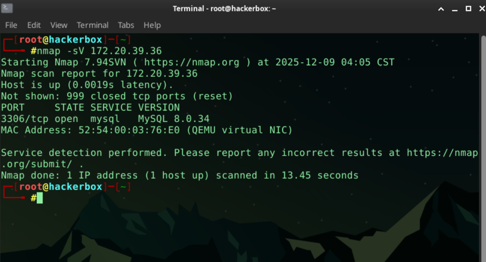
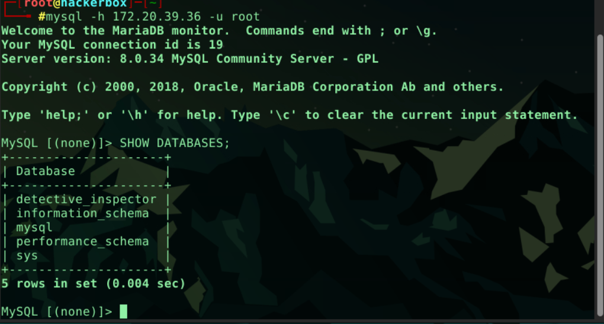
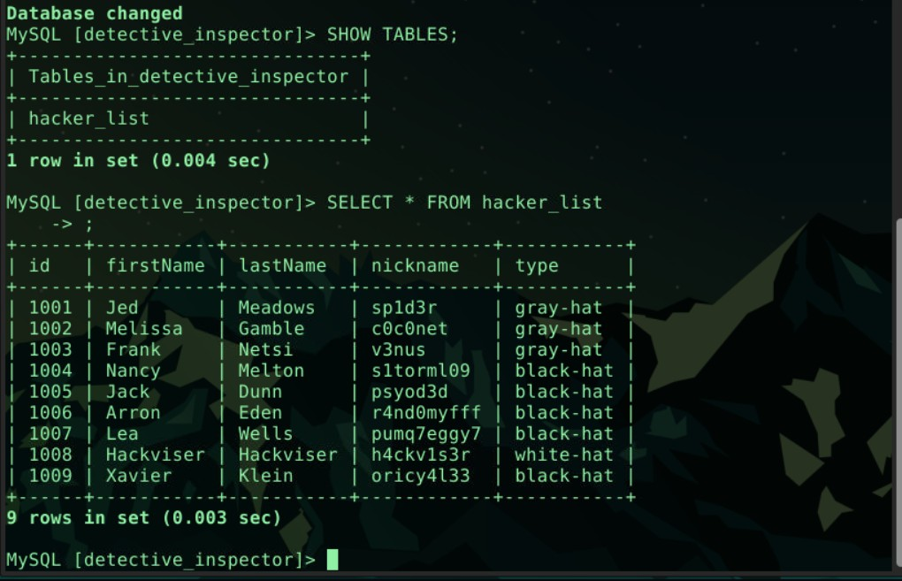

# 🔍 MySQL Servis Keşfi ve Veri Analizi (Lab Çözümü)

Bu çalışma, hedef sistemde çalışan MySQL servisinin keşfi, veritabanlarının incelenmesi ve içerideki kayıtların analiz edilmesini kapsamaktadır.


---

## ❓ Sorular ve Cevaplar

**1. Hangi port(lar) açık?**  
> **3306/tcp**

**2. Çalışan servisin adı nedir?**  
> **MySQL**

**3. MySQL'e bağlanmak için kullanabileceğimiz en yetkili kullanıcı adı nedir?**  
> **root**

**4. MySQL'e bağlanırken hostname belirtmek için hangi parametre kullanılır?**  
> **-h**

**5. Bağlı MySQL sunucusunda kaç veritabanı var?**  
> **5**

**6. Hangi komutla bir veritabanı seçebiliriz?**  
> `USE <veritabanı_adı>;`

**7. detective_inspector veritabanındaki tablonun adı nedir?**  
> **hacker_list**

**8. Beyaz şapkalı hacker'ın kullanıcı adı nedir?**  
> **h4ckv1s3r**

---

## 🔍 Keşif ve Çözüm Adımları

### Nmap

Hedef IP üzerinde gerçekleştirilen taramada yalnızca **3306/tcp** portunun açık olduğu görülmüştür

```bash
nmap -sV <Hedef_IP>
```

---
### MySQL bağlantısı
```bash
mysql -h 172.20.39.36 -u root
```
Hostname belirtmek için kullanılan parametre: -h

---
### Veritabanı keşfi
```bash
SHOW DATABASES;
```
5 adet veritabanına erişiyoruz.


---
### keşif
```bash
USE detective_inspector;
SHOW TABLES;
```
içerisinde sadece tek bir tablo bulunmaktadır hacker_list

### içeriği görme
```bash
SELECT * FROM hacker_list;
```
ile dosya içeriğini inceleyip son sorunun cevabını da bulmuş oluyoruz



